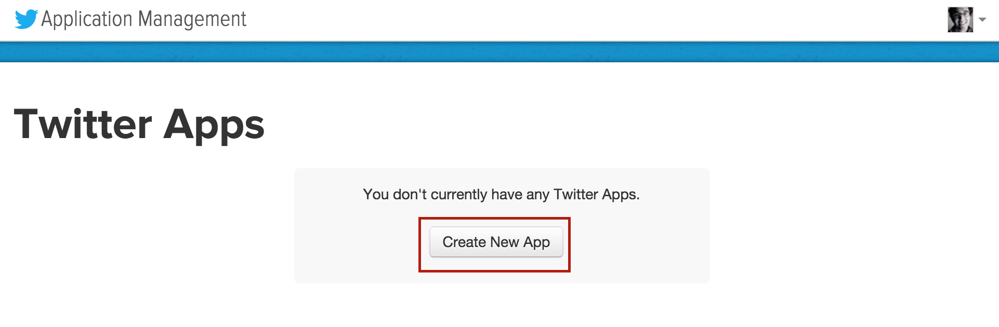
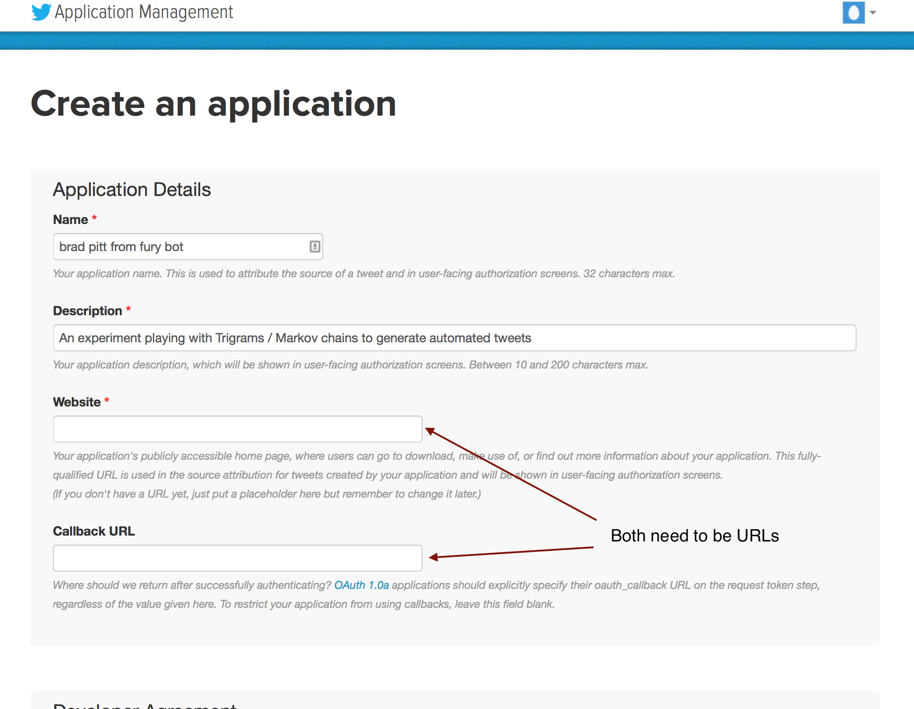

# Twitterbot

> A skeleton project to get a basic programmable twitter account up and running.

# How To Use This Project

First you need to create a new twitter account at [twitter.com](https://twitter.com/). You can use your personal account if you want, but you will probably annoy all of your followers.

Next you need to go to https://apps.twitter.com/ (in the same browser you are signed into your new account on). On this page you will click on the 'Create New App' button.



You will need to fill out some information about your app including two URLs that would be used as part of OAUTH. This little project doesn't need OAUTH, so just fill in some URLs into these fields, they don't have to be real URLs.



When your app has been created you will need to click on the 'manage keys and access tokens' link.


Now click on the 'create my access token' button.


Now you will see a screen that contains 4 credentials that you will need to copy into this project.


Copy the 4 credentials into a file called `.env` in the root of this project.  The file should look like this:

```
TWITTER_CONSUMER_KEY=consumer_key_from_twitter
TWITTER_CONSUMER_SECRET=consumer_secret_from_twitter
TWITTER_ACCESS_TOKEN=access_token_from_twitter
TWITTER_ACCESS_TOKEN_SECRET=access_token_secret_from_twitter
```

__Note: This project ignores the `.env` file so that you don't accidentally commit your credentials.__

Once you have created your .env file with the credentials from twitter you should be able to do the following from a terminal:

```bash
cd /wherever/you/cloned/this/repo
bundle install
./bin/bot
```

And it will post a tweet from your new twitter account that says, "I'm tweeting with @gem". Now you can start customizing your bot however you like.
